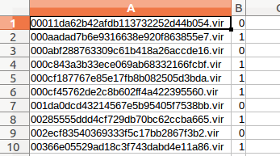

# State Change
1. ember/features.py: change row variables  
2. remove resource directory
3. change script files
4. add 01_extract.py, 02_train.py, 03_predict.py, 04_get_accuracy.py
(this refer to ember/init.py, ember/features.py)
5. add utils directory
6. add Test directory


# Reference
https://github.com/endgameinc/ember  

H. Anderson and P. Roth, "EMBER: An Open Dataset for Training Static PE Malware Machine Learning Models”, in ArXiv e-prints. Apr. 2018.  

```
@ARTICLE{2018arXiv180404637A,  
  author = {{Anderson}, H.~S. and {Roth}, P.},  
  title = "{EMBER: An Open Dataset for Training Static PE Malware Machine Learning Models}",  
  journal = {ArXiv e-prints},  
  archivePrefix = "arXiv",  
  eprint = {1804.04637},  
  primaryClass = "cs.CR",  
  keywords = {Computer Science - Cryptography and Security},  
  year = 2018,  
  month = apr,  
  adsurl = {http://adsabs.harvard.edu/abs/2018arXiv180404637A},  
}  
```  

# Install
above python 3.5    
```
;install virtualenv
$ virtualenv emberenv -p python3
$ . ./emberenv/bin/activate
```
  
```
;install python modules
(emberenv)$ pip install -r requirements.txt
(emberenv)$ pip install -U scikit-learn
```

# inputfile(csv including label) structure
without column's names


# Summary of run
```
  sript/01_extract.sh -> script/02_learn.sh -> script/03_predict.sh -> script/04_get_accuracy.sh
```  
  or    

```
  script/run.sh
```
